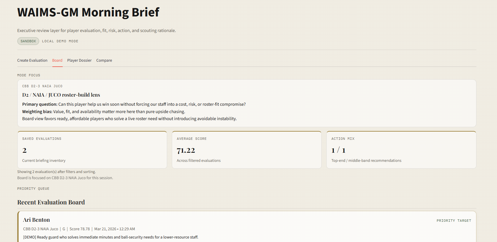
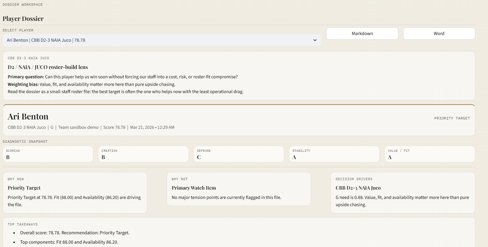
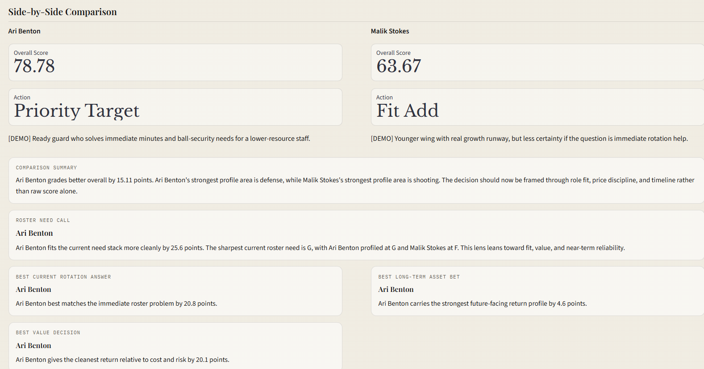
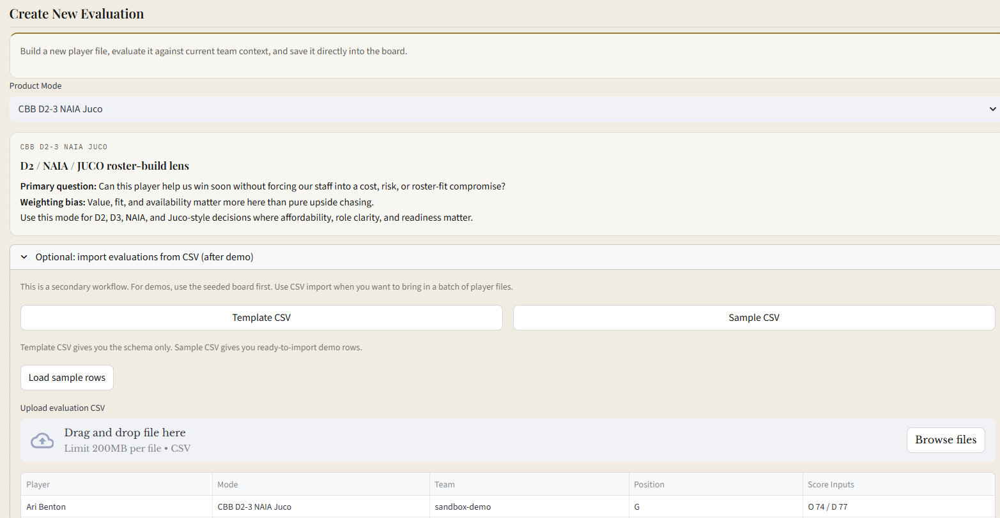

# WAIMS-GM

WAIMS-GM is the commercial wedge in the WAIMS product family: a basketball decision-support application built for smaller staffs that need a real board, dossier, staff-reporting workflow, and recruiting intake without hiring a custom analytics team.

It is built with a Streamlit frontend, a FastAPI backend, and Supabase-backed auth and persistence. The scoring core is deterministic and mode-aware, with optional AI/LLM augmentation reserved for future workflow enhancements rather than core system logic.

## Product Preview

### Board



### Player Dossier



### Compare



### Workflow Actions



## Problem

Smaller basketball staffs often make player decisions across disconnected tools:

- spreadsheets
- portal lists
- recruiting notes
- individual scout writeups
- verbal staff memory
- one-off consultant help

WAIMS-GM turns that fragmented process into one explainable decision workflow that basketball ops, coaches, sport science, and medical staff can actually use without engineering support.

## What It Does

WAIMS-GM currently supports:

- creating a player evaluation from structured inputs
- reusing team-context presets during intake
- importing batches of evaluations from CSV
- scoring each file with a mode-aware deterministic engine
- saving and revisiting a player board
- editing a saved evaluation without creating a duplicate
- opening a full player dossier
- separating player-file review from staff-report workflow
- comparing two players side-by-side
- exporting dossier and comparison artifacts for meetings
- running a structured `Med Diligence` and prospect-research workflow with evidence logging
- role-specific GM / Sport Science / Medical collaboration in local demo mode
- framing each player as a simple `Level / Delta` bet:
  - `Level` = expected contribution band
  - `Delta` = how much the outcome could swing

## Why Deterministic First

The current scoring core is intentionally deterministic instead of ML-first.

Why:

- coaches and operators can inspect why a file graded the way it did
- recommendations can be tuned by mode without retraining a model
- the product can prove workflow value before claiming predictive superiority
- future AI can be added as an assistive layer without turning the core score into a black box

This makes WAIMS-GM easier to trust, demo, debug, and explain.

## Level / Delta Lens

WAIMS-GM uses a simple `Level / Delta` lens to make the dossier easier to read:

- `Level` answers: what kind of contributor do we think this player is if things go roughly to plan?
- `Delta` answers: how wide is the outcome band, and how much could this bet swing up or down?

This keeps the product focused on decision quality, not black-box prediction language. It is especially useful for smaller staffs that need to:

- avoid misses
- identify rotation-value contributors
- price volatility correctly

Credit for the `Level / Delta` framing: **John Chisholm**.

Reference:

- Rebelo, et al. (2026). *Monitoring Training Effects in Athletes: A Multidimensional Framework for Decision-Making.* Sports Medicine. [https://lnkd.in/e6zWGQY5](https://lnkd.in/e6zWGQY5)

## Product Direction

WAIMS-GM is designed as the first sellable product in the broader WAIMS suite. It supports multiple basketball contexts today:

- `Pro / WNBA`
- `CBB High-Major`
- `CBB D2-3 NAIA Juco`
- `Recruiting Only`

The strongest near-term product wedge is small-staff college basketball, especially D2, NAIA, JUCO, lower-major, and many women’s programs where explainable roster, portal, and recruiting support is valuable.

## Commercial Positioning

WAIMS-GM should be pitched as:

- an affordable basketball operations product, not a consulting engagement
- an alternative to spreadsheet chaos, custom builds, and overbuilt enterprise stacks
- a workflow product that democratizes access to board, dossier, staff-report, and recruiting capabilities for programs without dedicated data teams

This means the launch packaging is:

- `Starter`: WAIMS-GM only
- `Performance Add-On`: WAIMS Python for athlete monitoring and readiness operations
- `Advisory Setup`: optional onboarding, workflow setup, and data cleanup

## Privacy Boundary

WAIMS-GM is a front-office decision workspace, not a medical record system. The `Med Diligence` layer is limited to public-file review, movement observations, and advisory risk framing for outside prospects.

See [PRIVACY.md](/C:/GitHub/waims-gm/PRIVACY.md) for the FERPA / privacy boundary used by this repo.

## Stack

- Streamlit UI
- FastAPI API
- Supabase auth + persistence
- deterministic scoring engine in `waims_gm/services/__init__.py`
- local no-auth demo mode for portfolio/interview use

## Roadmap

Near-term:

- keep the sellable wedge focused on `CBB D2-3 / NAIA / JUCO`
- keep `Create -> Save -> Board -> Dossier -> Compare -> Export` stable and demo-safe
- improve reusable team context presets and edit-after-save workflow
- keep the WAIMS Python diligence handoff lightweight, visible, and clearly separate from protected medical records

Mid-term:

- bring in richer external basketball data sources
- support more realistic staff workflows, collaboration, and team-context inputs
- add assistive AI for memo drafting, note cleanup, and data normalization

Long-term:

- evaluate whether WAIMS-GM stays a focused stand-alone basketball product
- or becomes a basketball module within the broader WAIMS platform

## Live Code Map

- Backend API: `app/main.py`
- Frontend UI: `streamlit_app.py`
- Scoring engine: `waims_gm/services/__init__.py`
- Domain models: `waims_gm/domain.py`
- Shared environment config: `app/config.py`

`app/main.py` is the backend source of truth for:

- API models
- auth validation
- persistence helpers
- live endpoint behavior

Files under `app/auth.py`, `app/models.py`, `app/routes/`, and `app/services/` are compatibility wrappers around `app.main` and should not be treated as separate implementations.

## Architecture

For a deeper walkthrough, see [docs/ARCHITECTURE.md](C:/GitHub/waims-gm/docs/ARCHITECTURE.md).

### Streamlit UI

`streamlit_app.py` handles:

- intake form
- CSV import preview + upload
- decision board
- dossier/detail rendering
- compare mode
- export actions
- environment badge and runtime labeling

### FastAPI backend

`app/main.py` handles:

- `/health`
- `/evaluate`
- `/evaluate-and-save`
- `/evaluations`
- `/evaluations/{evaluation_id}`
- `DELETE /evaluations/{evaluation_id}`

### Supabase

Supabase handles:

- access-token-based auth
- row-level security
- evaluation record persistence
- GM profile persistence

If you need a quick local helper for fetching a Supabase access token, use:

```powershell
python scripts/get_token.py
```

## Environment Profiles

WAIMS-GM now supports explicit `sandbox` and `live` runtime labels through environment variables shared by the frontend and backend.

Available example files:

- `.env.example`
- `.env.sandbox.example`
- `.env.live.example`

Important variables:

- `WAIMS_ENV`
- `WAIMS_ENV_LABEL`
- `API_BASE_URL`
- `SUPABASE_URL`
- `SUPABASE_ANON_KEY`
- `SUPABASE_JWT_AUD`

Recommended setup:

1. Copy `.env.sandbox.example` to `.env` for local and QA work.
2. Copy `.env.live.example` to the deployment platform's secret store for production.
3. Keep sandbox and live pointed at separate Supabase projects whenever possible.
4. Verify the Streamlit header and sidebar show the intended environment before testing or deleting records.

## Run Locally

### First-time setup

```powershell
python -m venv .venv
.venv\Scripts\python.exe -m pip install -e .[dev]
Copy-Item .env.sandbox.example .env
```

### Interview-safe local demo mode

Run the app with in-memory demo dossiers and no backend/auth dependency:

```powershell
powershell -ExecutionPolicy Bypass -File scripts\demo_bootstrap.ps1
```

This mode uses:

- local deterministic scoring
- in-memory demo dossiers
- no bearer token
- no FastAPI requirement
- no Supabase dependency

### Full local stack

Start the backend:

```powershell
C:\GitHub\waims-gm\.venv\Scripts\python.exe -m uvicorn app.main:app --reload
```

Start the frontend:

```powershell
C:\GitHub\waims-gm\.venv\Scripts\python.exe -m streamlit run streamlit_app.py
```

Optional helper script for full-stack startup:

```powershell
powershell -ExecutionPolicy Bypass -File scripts\demo_bootstrap.ps1 -FullStack
```

## End-to-End Manual QA

Use this flow to verify Streamlit + FastAPI + Supabase together:

1. Start the backend with the sandbox `.env`.
2. Confirm `/health` reports `sandbox`.
3. Start Streamlit and confirm the header badge and sidebar say `Sandbox`.
4. Fetch a sandbox Supabase token with `python scripts/get_token.py`.
5. Paste the token into the sidebar and click `Refresh board`.
6. Create a new evaluation and confirm the save succeeds.
7. Verify the new evaluation appears on the board.
8. Open the dossier and confirm recommendation, score cards, Decision Lens, and Five Layer Diagnostic render correctly.
9. Download the dossier `.md` file.
10. Download the dossier `.docx` file if Word export is enabled.
11. Select a second player in compare mode and confirm the roster-need call, verdict cards, and component comparison render.
12. Download the comparison brief `.md` file.
13. Delete the selected evaluation and confirm it disappears from the board.

## Tests

The repo includes coverage for:

- mode-aware scoring behavior
- scorecard component schema
- health and evaluate API paths
- mocked save/list/detail/delete lifecycle flows
- reporting and compare/export helpers

Run tests with:

```powershell
C:\GitHub\waims-gm\.venv\Scripts\python.exe -m pytest -q
```

## Demo and Sandbox Assets

Useful repo assets for demos and environment setup:

- demo walkthrough: [DEMO_SCRIPT.md](C:/GitHub/waims-gm/DEMO_SCRIPT.md)
- product positioning note: [POSITIONING.md](C:/GitHub/waims-gm/POSITIONING.md)
- architecture note: [docs/ARCHITECTURE.md](C:/GitHub/waims-gm/docs/ARCHITECTURE.md)
- Supabase schema and RLS setup: [supabase/waims_gm_schema.sql](C:/GitHub/waims-gm/supabase/waims_gm_schema.sql)
- demo data seeding script: [scripts/seed_demo_data.py](C:/GitHub/waims-gm/scripts/seed_demo_data.py)
- demo bootstrap script: [scripts/demo_bootstrap.ps1](C:/GitHub/waims-gm/scripts/demo_bootstrap.ps1)
- sample CSV import file: [examples/waims_gm_import_sample.csv](C:/GitHub/waims-gm/examples/waims_gm_import_sample.csv)

Import evaluations from a spreadsheet in the `Create Evaluation` tab:

- download the in-app template CSV for the expected columns
- or start from [examples/waims_gm_import_sample.csv](C:/GitHub/waims-gm/examples/waims_gm_import_sample.csv)
- preview rows before saving
- skip duplicates automatically by `player_id + team_id`
- optionally replace matching evaluations during import

Seed the sandbox with repeatable demo players using:

```powershell
C:\GitHub\waims-gm\.venv\Scripts\python.exe scripts\seed_demo_data.py
```

Preview the demo file set without authenticating:

```powershell
C:\GitHub\waims-gm\.venv\Scripts\python.exe scripts\seed_demo_data.py --list
```

Preview what a seed run would do without writing any records:

```powershell
C:\GitHub\waims-gm\.venv\Scripts\python.exe scripts\seed_demo_data.py --dry-run
```

Seed only one targeted demo file by canonical ID or player name:

```powershell
C:\GitHub\waims-gm\.venv\Scripts\python.exe scripts\seed_demo_data.py --only demo_high_major_portal_guard
```

To replace existing demo rows with the latest seeded set:

```powershell
C:\GitHub\waims-gm\.venv\Scripts\python.exe scripts\seed_demo_data.py --replace
```

## Preflight Checklist

Before local demos or deployment, run the preflight script:

```powershell
C:\GitHub\waims-gm\.venv\Scripts\python.exe scripts\preflight.py
```

Optional health check once the API is running:

```powershell
C:\GitHub\waims-gm\.venv\Scripts\python.exe scripts\preflight.py --check-health
```

The preflight script verifies:

- required environment variables are present
- placeholder values are rejected
- `live` is not pointed at obviously fake/sandbox configuration
- `/health` matches the intended environment when requested

## Deploying to Render

A Render blueprint file is included at `render.yaml`.

Note: the current blueprint defines both sandbox and live services. If you want to run only one environment at first, delete the unused services from `render.yaml` before creating the Blueprint, or disable those services in the Render dashboard after import.

### Render service commands

Backend start command:

```bash
python -m uvicorn app.main:app --host 0.0.0.0 --port $PORT
```

Frontend start command:

```bash
python -m streamlit run streamlit_app.py --server.address 0.0.0.0 --server.port $PORT
```

### Suggested sandbox env vars

```text
WAIMS_ENV=sandbox
WAIMS_ENV_LABEL=Sandbox
API_BASE_URL=https://your-sandbox-api-domain
SUPABASE_URL=https://your-sandbox-project.supabase.co
SUPABASE_ANON_KEY=...
SUPABASE_JWT_AUD=authenticated
```

### Suggested live env vars

```text
WAIMS_ENV=live
WAIMS_ENV_LABEL=Live
API_BASE_URL=https://your-live-api-domain
SUPABASE_URL=https://your-live-project.supabase.co
SUPABASE_ANON_KEY=...
SUPABASE_JWT_AUD=authenticated
```

## Notes

- Do not commit real `.env` files.
- Do not commit Supabase service-role keys.
- The frontend and backend both show the active environment label so you can tell if you are in `sandbox` or `live`.
- Use separate Supabase projects for sandbox and live whenever possible.
