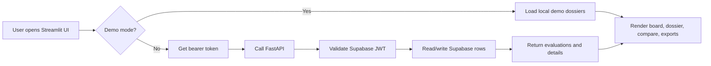
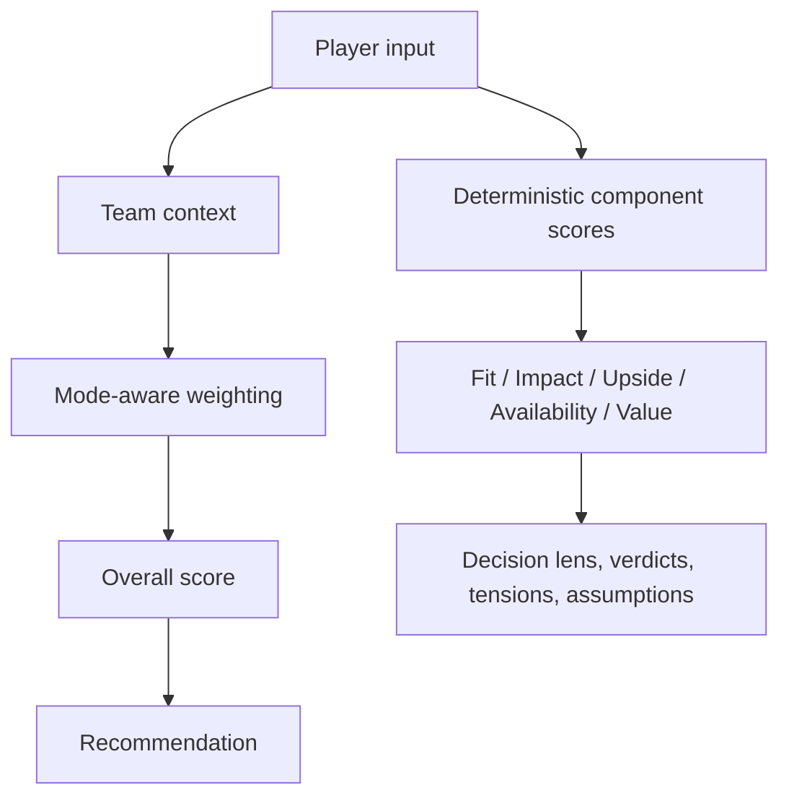

# WAIMS-GM Architecture

## Overview

WAIMS-GM is a basketball decision-support application with two operating modes:

- full stack sandbox/live mode
- local interview demo mode

The same Streamlit interface can run against either:

- a FastAPI + Supabase backend
- a local in-memory demo dataset

## Core Stack

- Streamlit UI: [streamlit_app.py](C:/GitHub/waims-gm/streamlit_app.py)
- FastAPI API: [app/main.py](C:/GitHub/waims-gm/app/main.py)
- Scoring engine: [waims_gm/services/__init__.py](C:/GitHub/waims-gm/waims_gm/services/__init__.py)
- Domain models: [waims_gm/domain.py](C:/GitHub/waims-gm/waims_gm/domain.py)
- Environment config: [app/config.py](C:/GitHub/waims-gm/app/config.py)
- Demo scenarios: [waims_gm/demo_data.py](C:/GitHub/waims-gm/waims_gm/demo_data.py)

## Runtime Modes

### Full Stack

In full stack mode:

- Streamlit calls FastAPI over HTTP
- FastAPI validates Supabase JWTs
- Supabase stores GM profiles and evaluations
- the app supports create/list/detail/delete and export flows against persisted data

### Local Interview Demo Mode

In local demo mode:

- `WAIMS_DEMO_MODE=1`
- Streamlit skips bearer-token requirements
- canonical demo payloads are scored locally with the deterministic engine
- create/delete actions run in local session state
- compare/export still work without backend or Supabase dependencies

## Main Request Flow

## Scoring Flow

## Interview Talking Points

- deterministic scoring core, not black-box AI
- explainable dossier and compare workflow
- sandbox/live runtime separation
- seeded local demo mode to remove operational risk during demos
- product framing aimed at lower-resource basketball programs first
